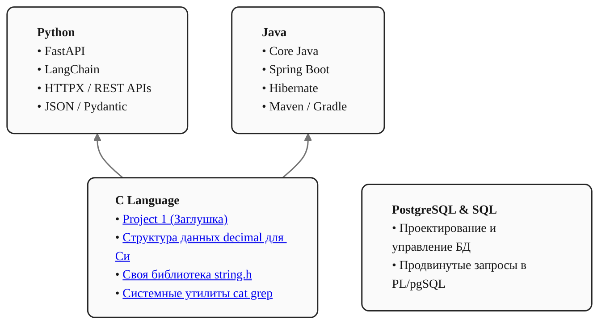

```mermaid
%%{init: {'theme': 'base', 'themeVariables': { 'fontSize': '14px', 'fontFamily': 'Inter, system-ui, -apple-system, sans-serif' }}}%%
flowchart BT
    c_lang["<div style='text-align: left; padding: 1px;'><b>C Language</b><br/>• <a href='https://github.com/'>Project 1 (Заглушка)</a><br/>• <a href='https://github.com/fanofanapa/decimal_lib_c_edu'>Структура данных decimal для Си</a><br/>• <a href='https://github.com/fanofanapa/strings_lib_c_edu'>Своя библиотека string.h</a><br/>• <a href='https://github.com/fanofanapa/cat_grep_educational/tree/main'>Системные утилиты cat grep</a></div>"]
    
    sql["<div style='text-align: left; padding: 4px;'><b>PostgreSQL & SQL</b><br/>• Проектирование и управление БД<br/>• Продвинутые запросы в PL/pgSQL</div>"]

    java["<div style='text-align: left; padding: 4px;'><b>Java</b><br/>• Core Java<br/>• Spring Boot<br/>• Hibernate<br/>• Maven / Gradle</div>"]
    
    python["<div style='text-align: left; padding: 4px;'><b>Python</b><br/>• FastAPI<br/>• LangChain<br/>• HTTPX / REST APIs<br/>• JSON / Pydantic</div>"]

    c_lang --> python
    c_lang --> java

    %% Минималистичный стиль узлов: светлый фон, темные тонкие рамки, скругленные углы (rx/ry)
    classDef default fill:#fafafa,stroke:#262626,stroke-width:1.5px,color:#171717,rx:8px,ry:8px;
    
    %% Строгий стиль линий
    linkStyle default stroke:#737373,stroke-width:1.5px;
```
