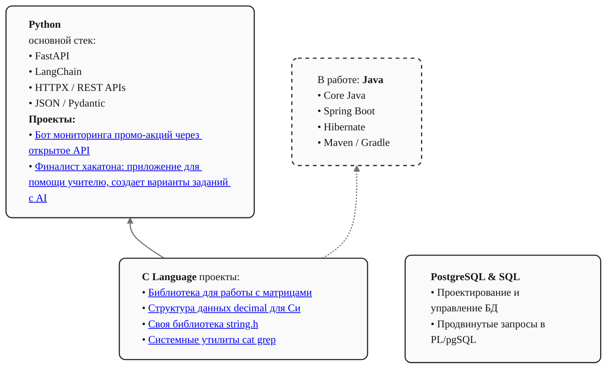

### Привет, я Георгий

Это описание содержит информацию о моих навыках и проектах, но сначала немного обо мне:

Учусь в "школе 21" от СБЕРА по направлению backend разработки, развиваюсь в направление AI и промпт инжиниринга. 
Также увлечен тестированием и автоматизацией.

Начинал с языка Си, но сейчас основным инструментом является python, в особенности фреймворки для работы с LLM и создания агентов.  
Также начинаю разбираться в java, интересует нагрузочное тестирование.

Чуть ниже карта навыков, она постоянно дополняется, и пока она в процессе разработки, проекты могут быть оформлены не до конца.

